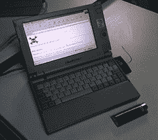

# Hackaday 复古综述:超便携版

> 原文：<https://hackaday.com/2013/01/12/hackaday-retro-roundup-ultraportables-edition/>

几个月前，我们推出了更新的 Hackaday，这是一个急需的新布局，取代了自 2004 年以来一直未变的 HTML 和 CSS。当然，有些人不喜欢变化，抱怨加载速度慢。我们也经历了稍微慢一点的加载时间，所以我们只能等到 2020 年，那时我们的计算机速度快很多倍，我们的互联网由谷歌光纤提供。在那之前，我们的小型战斗站和老式电脑仍然可以在我们的复古网站上查看一些经典的黑客攻击[。以下是过去几周和几个月里出现的一些复古成功案例——黑客读者拿出他们的旧技术，加载到复古网站上。](http://retro.hackaday.com/)

Macbook Air、几台索尼 Vaios 以及一大堆 eee 和其他上网本背后的想法——为一台极小的便携式电脑牺牲可扩展性和马力——并不新鲜。超便携电脑总能找到自己的位置，无论是被带到战区的 TRS-80(就像我们本周早些时候看到的带有新主板的那款),还是被用作时尚配饰的漂亮 Powerbook duo，或者是代表产品系列中最低端的 Macbook Air。

超便携电脑还有另一个优点:它们足够小，可以放在地下室的一个盒子里，然后被遗忘 20 年。在一座容纳 60 MHz 486 的巨大 ATX 铁塔是旧货出售或去回收中心的首选之地的地方，一台超级便携电脑可能会被遗忘多年。

过去几周我们收到了两份复古挑战赛的申请。首先是柯蒂斯和他的东芝 Libretto 100c t T1。它有 133 兆赫的奔腾处理器和 64 兆的内存。[柯蒂斯]让他小小的笔记本上网有点困难；他最终从 Netgear MR314 无线路由器上抢救出一个网卡，并将其插入 PCMCIA 插槽。将驱动程序安装到机器上是一件痛苦的事情，但是在将路由器配置为访问服务器并设置了终端连接之后，他能够将他的小盒子放到网络上了。

接下来是[Eugenio]，[再次带着歌词](http://retro.hackaday.com/Success/pics/23.jpg)，这次是 CT50。一台从奔腾时代起就有能力的机器，[Eugenio]运行的是 Windows 95 和 Netscape Communicator 4。还有一款老式的[索尼 Vaio 绘本](http://retro.hackaday.com/Success/pics/24.jpg)，世纪之交的一款更小的超便携笔记本。

目前就这些，但是如果你有一个复古的提交要发送，[在 Hackaday tip line 上给我们喊一声](http://hackaday.com/contact-hack-a-day/)。