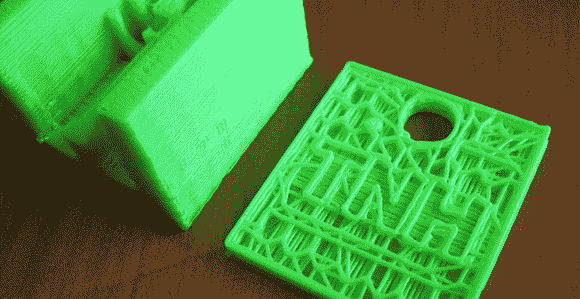

# 签署您的 3D 照片

> 原文：<https://hackaday.com/2013/01/07/signing-your-3d-prints/>

对于互联网上所有的 3D 模型，包括其他制造商每天都在复制的 Thingiverse 上的 STL 文件，还没有一种好的方法可以在你设计的三维塑料上签名。【Chris】一直在思考一个在网上发布的 STL 文件现在完全不在创作者手里有一段时间了，他终于想出了[一个签署 3D 打印的好方案](http://thenewhobbyist.com/2012/12/signing-3d-prints/)。

[Chris]一直在研究如何在印刷品的前几层“压印”制造商的标记，但这并不总是可行的。有时候印刷品的底部需要一个光滑的表面，所以[Chris]把他的首字母移到了印刷品主体的上面几层。

通过从印刷品内部减去 1.0 毫米厚的首字母版本，[Chris]能够将他的制造商的标记放在 3D 对象的内部，在生产过程中只有很短的时间可见。

签名不是不可能被删除，但它确实给了原设计者一点荣誉，所有这些都没有一些奇怪的 DRM 方案或附加到 STL 文件的元数据。

休息之后，你可以看看[Chris]的印刷商印了几层他的商标。

[https://www.youtube.com/embed/zv_OQN2H590?version=3&rel=1&showsearch=0&showinfo=1&iv_load_policy=1&fs=1&hl=en-US&autohide=2&wmode=transparent](https://www.youtube.com/embed/zv_OQN2H590?version=3&rel=1&showsearch=0&showinfo=1&iv_load_policy=1&fs=1&hl=en-US&autohide=2&wmode=transparent)