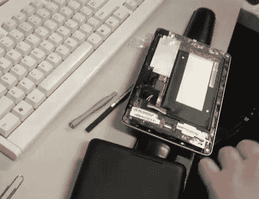

# Nexus 7 扬声器失真的气泡包装疗法

> 原文：<https://hackaday.com/2013/01/07/bubble-wrap-cure-for-nexus-7-speaker-distortion/>

[家居品牌可乐]对自己的 Nexus 7 除了内置扬声器还挺满意的。它产生相当好的音频质量，直到他达到大约 50%的音量水平。任何产生失真的东西。他想出了如何用一小块气泡包装来修理它。

当他使用他的 Nexus 7 时，他发现他可以通过用手指和拇指紧紧抓住外壳的顶部和底部来修复变形，这是一个惊喜。这让他意识到扬声器单元有点松动，当它振动外壳时会产生不必要的噪音。广告之后的视频显示了修复方法，即在扬声器单元的顶部放置一条气泡包装(看起来大约 1 英寸乘 3 英寸)。当外壳合上后，包装材料有助于将所有东西固定到位，现在他可以毫无问题地使用他的平板电脑。Reddit 帖子上的一条评论询问了添加这种塑料的热量问题。他已经用了几个星期了，到目前为止没有任何问题。

[https://www.youtube.com/embed/5_0wMo87cus?version=3&rel=1&showsearch=0&showinfo=1&iv_load_policy=1&fs=1&hl=en-US&autohide=2&wmode=transparent](https://www.youtube.com/embed/5_0wMo87cus?version=3&rel=1&showsearch=0&showinfo=1&iv_load_policy=1&fs=1&hl=en-US&autohide=2&wmode=transparent)