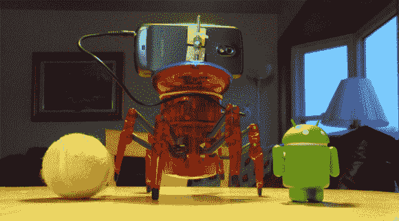

# 给六角蜘蛛一双眼睛

> 原文：<https://hackaday.com/2013/01/08/giving-the-hexbug-spider-a-set-of-eyes/>

Hexbug 蜘蛛是一个小巧的机器人玩具，在任何一家塔吉特百货或沃尔玛都可以买到，价格约为 20 美元。然而，通过一些额外的部件，它可以成为一个强大得多的机器人平台，正如[eric]用 Hexbug 和 OpenCV 的实验向我们展示的那样。

之前，我们已经看到[eric]用一对红外发光二极管和一个替代电机驱动器将一个 Hexbug 蜘蛛[变成了一个直线跟随机器人](http://hackaday.com/2012/11/12/turning-the-hexbug-spider-into-a-line-following-robot/)。这一次，不是几个发光二极管，[eric]转向了运行基于 OpenCV 的应用程序的 Android 智能手机。

智能手机应用程序检测用户可选择的颜色——在这种情况下，是一个小小的 Android 玩具机器人——并通过耳机插孔向 MSP430 供电的电机控制板发送命令，以移动腿。这是一个整洁的建筑，对于一个 20 美元的塑料六足机器人来说，惊人的敏捷。

休息之后，你可以看到 OpenCV 控制的 Hexbug 在运行，还有一个视频构建日志，由[eric]向每个人展示如何拆开这些机器人玩具中的一个。

[https://www.youtube.com/embed/C3bWyM-DLRM?version=3&rel=1&showsearch=0&showinfo=1&iv_load_policy=1&fs=1&hl=en-US&autohide=2&wmode=transparent](https://www.youtube.com/embed/C3bWyM-DLRM?version=3&rel=1&showsearch=0&showinfo=1&iv_load_policy=1&fs=1&hl=en-US&autohide=2&wmode=transparent)