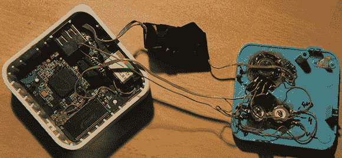

# 把一个小路由器变成网络收音机

> 原文：<https://hackaday.com/2013/01/08/turning-a-tiny-router-into-a-webradio/>

虽然黑客时代精神几乎完全集中在包括 Raspberry Pi 在内的所有新的 ARM 开发板上，但有些人仍然在通过修改现有的电子产品来满足他们的需求，以旧方式行事。[Peter]拿起一个我们以前见过的非常便宜的 TP-Link 703n 无线路由器，[将其改装成一个独立的网络收音机](http://piie.net/index.php?section=tplink-radio)，配有音量和调谐器旋钮。

TP-Link 703n 是一款比信用卡还小的无线路由器，在普通的中国经销商那里售价约为 20 美元。能够运行 OpenWRT，这个非常便宜的硬件可以转变成一个可以与 Raspberry Pi 相媲美的设备；一个完整的 Linux 系统，只有几个 GPIO 引脚。

[Peter]用他的 703n 路由器添加了一个 ATtiny85，连接到两个 pots 和内部 UART。这与从 pots 读取值的脚本一起，告诉路由器要调到哪个电台以及播放的音量。音频由内置扬声器的 USB 声卡处理，使[Peter]的产品成为我们见过的最小的专用互联网收音机之一。

休息之后你可以看到[彼得]的收音机在工作。

[https://www.youtube.com/embed/Z7XYYqrOnz?version=3&rel=1&showsearch=0&showinfo=1&iv_load_policy=1&fs=1&hl=en-US&autohide=2&wmode=transparent](https://www.youtube.com/embed/Z7XYYqrOnz?version=3&rel=1&showsearch=0&showinfo=1&iv_load_policy=1&fs=1&hl=en-US&autohide=2&wmode=transparent)