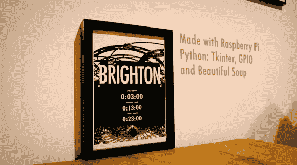

# 从网上抓取火车时刻的相框

> 原文：<https://hackaday.com/2013/01/08/picture-frame-that-scrapes-train-times-from-the-web/>

每当[加雷斯·詹姆斯]需要赶火车时，他只需按下这个框上的按钮，接下来的三个发车时间就会显示出来。从照片中的后期处理可以看出，这是由一个 Raspberry Pi 板使用一些熟悉的工具完成的。

先来看看硬件。他买了一个 7 英寸的液晶显示器，从塑料盒子里拿了出来。裸露的屏幕很容易安装在相当深的木质框架内，其复合视频输入使其与 RPi 板的接口非常简单。有一个小工作要做的权力。液晶显示器需要 12V，所以他使用 12V 壁式电源为框架供电，并包括一个 USB 车载充电器为 RPi 供电。他添加的最后一个东西是一个连接到 GPIO 头的按钮，告诉系统获取一组新的时间。

Python 脚本监控按钮，并使用漂亮的 Soup 从网站上抓取火车信息。为了得到他想要的外观，[Gareth]使用 tkinter 编写了一个 GUI。不要错过跳跃后的演示。

如果你需要一点搜集网络数据的基础知识，看看这个指南。

[https://www.youtube.com/embed/8V_qX3IULEM?version=3&rel=1&showsearch=0&showinfo=1&iv_load_policy=1&fs=1&hl=en-US&autohide=2&wmode=transparent](https://www.youtube.com/embed/8V_qX3IULEM?version=3&rel=1&showsearch=0&showinfo=1&iv_load_policy=1&fs=1&hl=en-US&autohide=2&wmode=transparent)