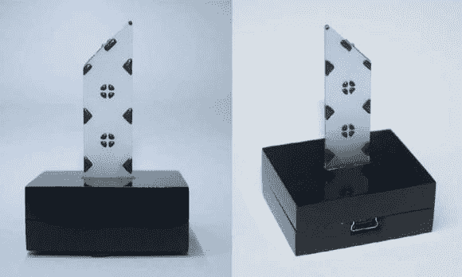

# 用于 RGB 灯的玻璃延迟线滑块

> 原文：<https://hackaday.com/2013/01/09/glass-delay-line-slide-used-in-an-rgb-lamp/>

这盏灯上的尖顶是一台旧电视机的一部分。这是一个玻璃延迟线幻灯片[管道光从蓝牙控制的 RGB 灯](http://www.pykaso.net/2013/01/06/vyslouzila-soucastka-jako-stylova-bluetooth-rgb-lampicka/)(翻译)在基地。

[我们之前已经看过延迟线](http://hackaday.com/2012/11/09/storing-32-bytes-of-data-in-a-piece-of-glass/)了，当时[达夫·琼斯]拆下一台摄像机去取延迟线。但是我们一定错过了 EEVblog 的后续章节，其中[解释了载玻片是如何工作的](http://www.eevblog.com/2012/11/19/eevblog-386-glass-delay-lines-part-2/)。该设备使用物理距离来形成延迟。进入载玻片边缘的波在收集点被检测到之前会以一定角度反弹。[Lukas]喜欢该零件的视觉外观，并决定用它来增加他的 lamp 项目的视觉趣味。玻璃的性质使其非常适合将光向上引导并远离 PCB。

该灯由一个由 ATtiny2313 微控制器控制的 RGB LED 模块组成。同时搭载的还有一个 HC-05 蓝牙模块。这与他编写的应用程序一起让用户无线改变灯的颜色和行为。你可以在休息后的视频中看到灯在工作，但我们认为相机拍摄可能没有做到应有的公正。

[https://www.youtube.com/embed/NXcoKb7UFYY?version=3&rel=1&showsearch=0&showinfo=1&iv_load_policy=1&fs=1&hl=en-US&autohide=2&wmode=transparent](https://www.youtube.com/embed/NXcoKb7UFYY?version=3&rel=1&showsearch=0&showinfo=1&iv_load_policy=1&fs=1&hl=en-US&autohide=2&wmode=transparent)