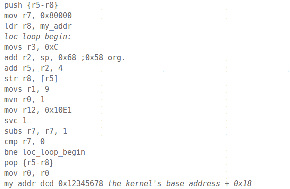

# 在 Windows RT 上运行的未签名代码

> 原文：<https://hackaday.com/2013/01/09/unsigned-code-running-on-windows-rt/>

在 Windows RT 的装甲中发现了一个裂缝。Windows 8 的这个子集旨在运行在 ARM 处理器上。上图[中列出的有效载荷允许你在操作系统](https://surfsec.wordpress.com/2013/01/06/circumventing-windows-rts-code-integrity-mechanism/)上运行未签名的桌面应用。

我们还没有看到太多关于 Windows RT 的包，所以很高兴听到[Clrokr]对它的想法。据他所知，该系统并没有从其面向英特尔(x86)的对手那里被削弱。相反，RT 似乎是一个打开了所谓的“代码完整性”机制的直接端口。有一个内核级设置，设置在 UEFI 的安全引导后面，它决定了允许在设备上运行的最低软件签名级别。这在 Windows 8 机器上设置为零，但在 ARM 设备上默认为 8。[Clrokr]使用调试器将上面看到的代码插入到 DLL 文件中，以便将最小签名值重置为 0。

在你的脑海中有没有一个项目对这个有用？我们很想在评论中听到它！

[via [Reddit](http://www.reddit.com/r/programming/comments/1633qs/circumventing_windows_rts_code_integrity_mechanism/)