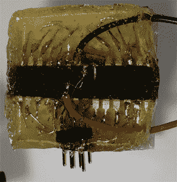

# 密封在环氧树脂块中的 8×8 LED 矩阵吊灯

> 原文：<https://hackaday.com/2013/01/10/8x8-led-matrix-pendant-sealed-in-a-block-of-epoxy/>

这是【德米特里·格林伯格的】 [8×8 LED 矩阵吊坠](http://dmitry.co/index.php?p=./04.Thoughts/12.%20Greyscale%20LED%20matrix%20pendant%208x8)的背面。他已经看过了使用 5×7 网格的[其他项目](http://hackaday.com/2012/10/12/led-matrix-pendants/)，但是对于在每个像素只有开或关的选项时在那个有限的区域中所能画出的数字并不真正满意。他的产品增加了绘图区域，并包括在几个不同级别显示每个像素的能力。

他使用的 ATmega328 微控制器直接焊接在 LED 模块背面的引脚上。他在固件中设计了 IO，以使焊接尽可能简单。为了保护硬件，他用胶带在 LED 封装的边缘制作了一个模子。随着环氧树脂变硬，胶带将环氧树脂固定在适当的位置，包住微控制器，并紧紧地固定住电源线和 ICSP 接头。

休息之后，你可以看到大约六秒钟的设备运行。每个像素的四个亮度等级真的很重要！

[https://www.youtube.com/embed/oJbfHoyyAJg?version=3&rel=1&showsearch=0&showinfo=1&iv_load_policy=1&fs=1&hl=en-US&autohide=2&wmode=transparent](https://www.youtube.com/embed/oJbfHoyyAJg?version=3&rel=1&showsearch=0&showinfo=1&iv_load_policy=1&fs=1&hl=en-US&autohide=2&wmode=transparent)