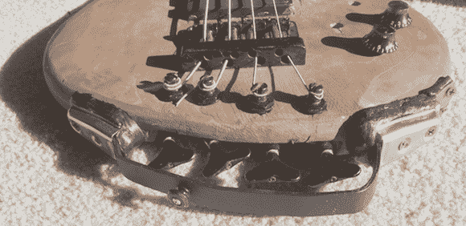

# 把一条破鲈鱼变成一条无头鲈鱼

> 原文：<https://hackaday.com/2013/01/11/turning-a-broken-bass-into-a-headless-bass/>

不久前，迈克尔从一个朋友那里继承了一把坏了的低音吉他。低音提琴的琴头从中间裂开了，这位朋友试图用一个螺栓和几个垫圈进行修理。在试图弄清楚增加一个螺栓是为了达到什么目的后，[迈克尔]开始着手修复这个低音，结果[做了一个无头转换](http://blog.makezine.com/2013/01/10/how-to-guitar-or-bass-headless-conversion/)。

无头低音，顾名思义，去掉了琴头，把调音器移到了吉他的另一边——就迈克尔而言，就在琴桥的正下方。锯掉桁架杆上方断裂的琴头后，[迈克尔]做了一个琴弦固定器，并用螺栓将其固定在琴颈的其余部分。

调谐器必须被移动，当然，所以[迈克尔]在桥下的身体的一部分路由了出去。钻了四个洞，原来的调谐器滑了进去。其结果是一个完美的功能低音，将适合在 80 年代的金属乐队的巡回车。

你可以在口袋里找到迈克尔的贝斯。

[https://www.youtube.com/embed/O83FpFXnynU?version=3&rel=1&showsearch=0&showinfo=1&iv_load_policy=1&fs=1&hl=en-US&autohide=2&wmode=transparent](https://www.youtube.com/embed/O83FpFXnynU?version=3&rel=1&showsearch=0&showinfo=1&iv_load_policy=1&fs=1&hl=en-US&autohide=2&wmode=transparent)