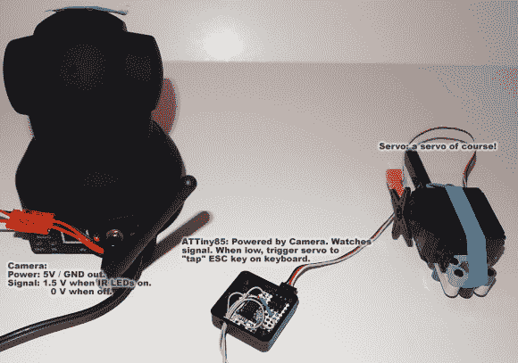

# 扩展 IP 摄像机的功能

> 原文：<https://hackaday.com/2013/01/11/extending-the-features-of-an-ip-camera/>

[戴夫·阿斯托尔福]希望能够让他的数控轧机自己运行，并能够远程监控。这种想法的唯一问题是，如果他检查并看到一些不好的事情发生，他还需要一个远程关闭开关。他最终通过给 IP 摄像头增加额外的功能实现了一举两得。

这些网络摄像头非常漂亮。只要插上他们的电源线，他们就会连接到 WiFi 并开始播放视频。它们中的许多都提供像平移和倾斜这样的功能，这种型号甚至具有用于夜间观看的红外 led，可以通过网络界面打开和关闭。这就是[戴夫]开始他的黑客生涯的起点。他接上了红外发光二极管的引线。他们被 85 号卫星监控着。当他通过网页打开 led 时，ATtiny85 会感应到它，并驱动伺服电机按下键盘上的 ESC 键。正如您在中断后的剪辑中看到的，这将停止其轨迹中的铣削。我们特别喜欢使用乐高技术件，使伺服安装可拆卸。

[https://www.youtube.com/embed/PZgWuric3Ok?version=3&rel=1&showsearch=0&showinfo=1&iv_load_policy=1&fs=1&hl=en-US&autohide=2&wmode=transparent](https://www.youtube.com/embed/PZgWuric3Ok?version=3&rel=1&showsearch=0&showinfo=1&iv_load_policy=1&fs=1&hl=en-US&autohide=2&wmode=transparent)