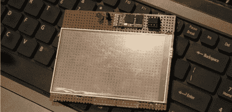

# 电阻式触摸屏的蓝牙触控板

> 原文：<https://hackaday.com/2013/01/14/a-bluetooth-trackpad-from-a-resistive-touchscreen/>

如果你已经在网上找到了你最喜欢的廉价中国电子产品零售商，你会发现一大堆替换零件。手机部件尤其常见，高分辨率液晶显示器只需几美元。还有一些触摸屏套件——电阻式触摸屏数字化仪，可以用微控制器轻松读取。[Vinod]得到了其中一个触摸屏数字转换器，在 8 针微控制器的帮助下[把它变成了蓝牙触控板](http://blog.vinu.co.in/2013/01/resistive-touch-screen-based-wireless.html)。

透明塑料触摸板是一种相对简单的设备。通过读取一对模拟值，很容易找到手指或触控笔在触摸板上的坐标。[Vinod]编写了一个 ATtiny13 程序来读取这些值并把它们转换成 x-y 坐标，但是他需要一些有用的东西来处理这些数据。

通过将一个小的蓝牙模块连接到他的微控制器上，[Vinod]可以将这些坐标发送到他的电脑上。结果是一个家酿触摸板，能够移动光标，左右点击，并模拟滚轮。

[https://www.youtube.com/embed/NSuIEGvD4jc?version=3&rel=1&showsearch=0&showinfo=1&iv_load_policy=1&fs=1&hl=en-US&autohide=2&wmode=transparent](https://www.youtube.com/embed/NSuIEGvD4jc?version=3&rel=1&showsearch=0&showinfo=1&iv_load_policy=1&fs=1&hl=en-US&autohide=2&wmode=transparent)