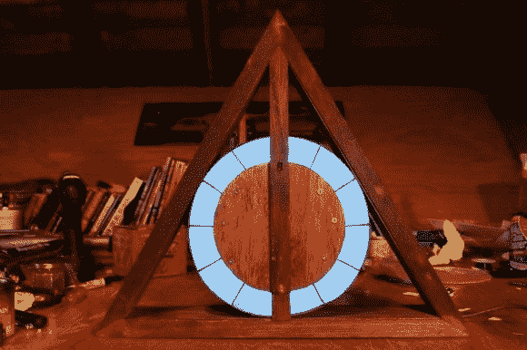

# 死亡圣器标志着时间的流逝

> 原文：<https://hackaday.com/2013/01/14/deathly-hallows-mark-the-passing-of-time/>

不管你是不是哈利波特迷，我们认为你会喜欢 T2 的这个死亡圣器钟。身体是仿照三角形，圆形和直线组成的象征，在结束幻想小说系列时发挥了突出作用。一点运动和几把发光二极管使它能够显示一天中的时间。

[Yeenasty]从用木头建造三角形围栏开始。在中心，他增加了一个圆形贴面，被分隔成 12 个房间。这些灯指示小时，从午夜到中午一次点亮一个。一旦所有的发光二极管打开(如上图所示)，它们就会从中午到午夜一次熄灭一个。[Yeenasty]提到这意味着时钟在夜间不会太亮。

分钟由 led 环中间的木制条板显示。这里显示的是整点后的 30 分钟，因为它是垂直的，底部的红色 LED 亮起。指针安装在一个 180 度的伺服系统上，因此当它旋转了一半时，指针返回 29 分钟，另一端的 LED 灯点亮，继续围绕钟面前进。

[via [Reddit](http://www.reddit.com/r/DIY/comments/16fbg4/deathly_hallows_themed_clock_xpost_from_rpics/)