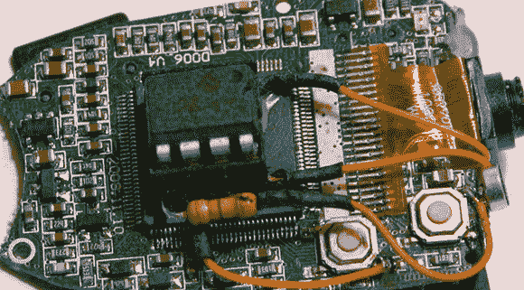

# 自动控制钥匙链相机的延时拍摄

> 原文：<https://hackaday.com/2013/01/15/automating-a-key-fob-camera-for-time-lapse/>

如果你用氦气球将数码相机高高地放入平流层，你真的没有比那些钥匙链间谍相机更好的了。由于重量极轻，分辨率相当高，它们是带到近空间的完美相机。如果你带人来拍照的话。

[罗曼]想把他的 808 间谍相机带到一个新的高度，但不想在 100，000 英尺的空中手动重置它[决定使用微控制器代替](http://geekenargentina.wordpress.com/2012/12/22/808-camera-automation/)。一个 8 引脚 PIC12F675 负责以 4 秒的间隔拍摄 60 张照片，然后切换到电影模式并录制 20 秒的视频。

在电压调节器的帮助下，整个设备可以由 6 到 9 伏供电。[Román]在拍摄了大约 1600 张照片后发现相机挂起，因此添加了从微控制器到复位开关的连接。一切都在地面上工作，所以我们迫不及待地想看看地球表面以上几英里的地方会发生什么。