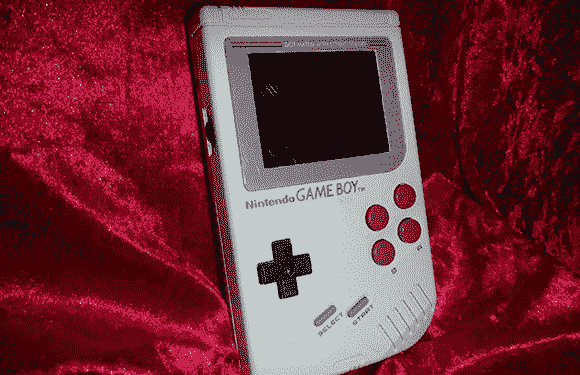

# 这个游戏机有点奇怪

> 原文：<https://hackaday.com/2013/01/15/theres-something-strange-about-this-game-boy/>

看起来像普通砖块游戏的男孩有两个额外的按钮，实际上是我们见过的最酷的便携式模块之一。

代替经典的 1989 年硬件，这款 Game Boy 的内部填充了一台 Dingoo A330 便携式仿真机，能够玩 Game Boy、Game Boy Advance 和其他 8 位和 16 位经典主机。

在对最初的 Game Boy 外壳进行大量修改后，[Alex]砍掉了两块 Game Boy PCBs，以便将 D pad、A、B、select 和 start 按钮连接到 Dingoo。添加了一对额外的按钮，并且在原来的音量和对比度控制位置放置了摇杆开关，模拟了 Dingoo 上的肩部按钮。

所有这些和新的彩色液晶显示器(和屏幕边框)意味着这款游戏机看起来几乎是库存，除了额外增加了一对按钮。这是一件令人难以置信的作品，我们非常嫉妒[亚历克斯]的朋友在他生日时收到这个。

休息之后，您可以看看这个内置的操作。

[https://www.youtube.com/embed/zWKhb6EOgJQ?version=3&rel=1&showsearch=0&showinfo=1&iv_load_policy=1&fs=1&hl=en-US&autohide=2&wmode=transparent](https://www.youtube.com/embed/zWKhb6EOgJQ?version=3&rel=1&showsearch=0&showinfo=1&iv_load_policy=1&fs=1&hl=en-US&autohide=2&wmode=transparent)