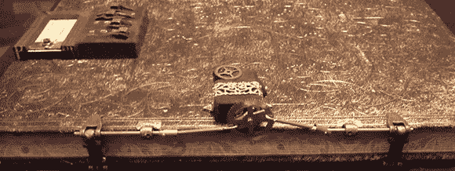

# 蒸汽朋克组合速写本

> 原文：<https://hackaday.com/2013/01/16/a-steampunk-combination-sketchbook/>

蒸汽朋克制品的优秀工匠，刚刚完成了一个新项目。这是一个由两层安全保护的素描本，覆盖着镀金的皮革，浸透了(儒勒·凡尔纳)小说的论述。

这本速写本的第一层安全措施是密码锁。盖子上有四个开关，每个开关有四个位置。这些都连接到 PICAXE 微控制器，一旦输入正确的组合，就会进入锁的下一阶段。

这本书的安全性还包括一个爆震传感器。通过隐藏在封面下的一个小型压电元件，[Ravensdale]在打开之前用特定的模式轻击书籍。机械部分是一个小的业余爱好伺服系统，也安装在盖子上，一旦两把锁都打开，就会释放一对黄铜扣。

像所有[海军上将]的建造一样，这是一件精美的工艺品，同样适合与男爵一起度假或去锡兰的鸦片馆。

休息之后，你可以看看 Ravensdale 上将]的素描本演示。

[https://www.youtube.com/embed/5rUtVLy9YiQ?version=3&rel=1&showsearch=0&showinfo=1&iv_load_policy=1&fs=1&hl=en-US&autohide=2&wmode=transparent](https://www.youtube.com/embed/5rUtVLy9YiQ?version=3&rel=1&showsearch=0&showinfo=1&iv_load_policy=1&fs=1&hl=en-US&autohide=2&wmode=transparent)