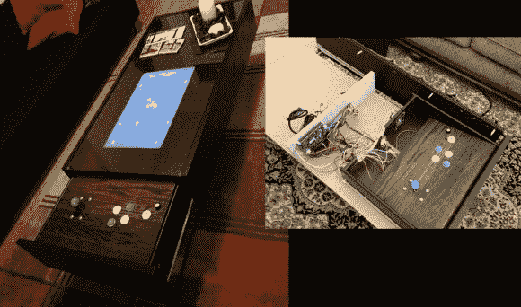

# 咖啡桌拱廊隐藏其控制

> 原文：<https://hackaday.com/2013/01/16/coffee-table-arcade-hides-its-controls/>

[Hoogen]做了一件了不起的工作，在这款宜家咖啡桌中加入了街机硬件。听起来熟悉吗？我们刚刚参观了[另一家宜家茶几商场](http://hackaday.com/2013/01/15/coffee-table-arcade-cabinet/)，但这家走的是完全不同的路线。它使用 Ramvik 桌子，桌子末端有一个很深的抽屉，里面有控制装置。左边的图像显示，当你试图关闭操纵杆时，它会出现问题。[胡根]想出了一个聪明的机制来克服这个问题。

这不是一个仿真系统。它使用一种叫做 iCade 60-in-1 的 JAMMA 板，将 60 款经典街机游戏融入其中。为了与这个硬件接口，[Hoogen]包括一个 JAMMA 全柜线束。右边的插图非常小，但它显示了安装在抽屉背面的扬声器，以及向下倾斜的控制表面。当关闭抽屉时，这个倾斜表面允许控制装置移开。正如[Hoogen]在他的文章中所描述的，这种情况会自动发生。