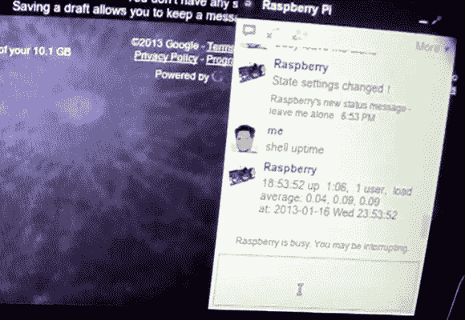

# 运行在树莓 Pi 上的谷歌聊天机器人

> 原文：<https://hackaday.com/2013/01/17/google-talk-bot-running-on-raspberry-pi/>

[Michael Mitchell]做了一个演示，演示如何使用 Google Talk 与脚本进行交流。虽然这个概念并不新鲜，但是我们还没有看到很多项目使用聊天界面来发布命令和接收数据。我想到的是[这个使用 Google Talk 的家庭自动化项目](http://hackaday.com/2013/01/07/google-talk-used-for-home-automation-communications-via-android/)，因为它比短信或电子邮件通信要快得多。

幸运的是，已经有一个名为[pygtalkprobot](http://code.google.com/p/pygtalkrobot/)的 Python 库，可以帮助 Google Talk 使用 XMPPPY 协议。除了这个包，[Michael]还安装了一些额外的东西，允许他通过 Python 访问 RPi 上的 GPIO 管脚。在休息后的视频中，他演示了开关和 LED 的开关，以及从连接到引脚 8 的滑动开关读取数据。当然，从操作系统本身编码反馈是轻而易举的事。正如您在上面的图像中看到的，RPi 在[Michael]发出命令后报告其正常运行时间

[https://www.youtube.com/embed/vd6RlkAXWRs?version=3&rel=1&showsearch=0&showinfo=1&iv_load_policy=1&fs=1&hl=en-US&autohide=2&wmode=transparent](https://www.youtube.com/embed/vd6RlkAXWRs?version=3&rel=1&showsearch=0&showinfo=1&iv_load_policy=1&fs=1&hl=en-US&autohide=2&wmode=transparent)