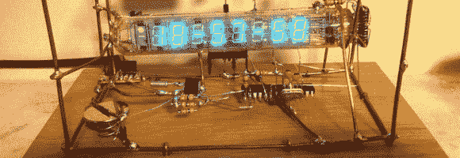
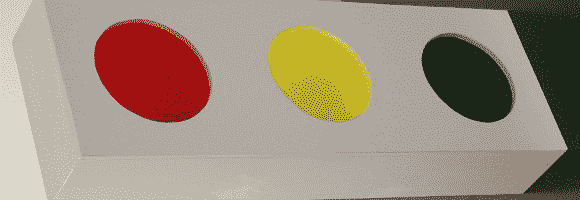
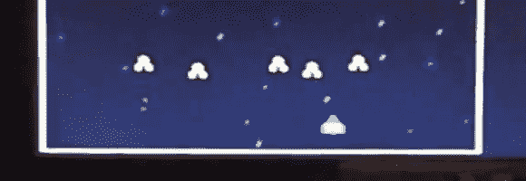
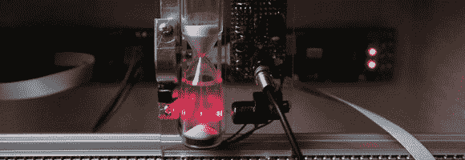
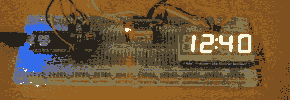

# 黑客日链接:2013 年 1 月 17 日

> 原文：<https://hackaday.com/2013/01/17/hackaday-links-january-17th-2013/>

**自由格式** **VFD 时钟**

[James]完成这项工作不需要电路板，甚至不需要原型板。[他自由设计了他的 VFD 时钟](http://www.jamesglanville.com/wordpress/?p=31)的所有电路。目前，这是他博客上唯一的项目，所以点击一下，看看他是怎么做到这一点的。

**DIY LED 交通灯**

这是一个临时搭建的交通灯，Jarle 用它来显示他的服务器的信息。如果你不能[找到你自己被风暴破坏的原版](http://hackaday.com/2012/11/19/sandy-brings-a-traffic-light-avr-brings-the-control-electronics/)，这是一个非常简单的方法来建造一个。

**FPGA 太空攻击游戏**

这个[游戏是在 FPGA](http://int80h.se/post/35217915535/this-project-was-made-as-the-final-project-in-a) 上运行的，但是不是用 HDL 写的。相反，[Johan]用 C 写了这个游戏，让它在加载在门阵列上的软处理器上运行。

**沙漏熵**

这是一个产生随机数的有趣想法。正在用激光照射光敏晶体管。[激光器的光束被沙漏](http://gieskes.nl/undefined/eurorack/?f=laserloper)落下的沙子打断。这种技术可以用作随机数生成熵源。

**用于数字时计的 GPS 时钟源**

这看起来像是大材小用，但是使用 GPS 模块作为时钟源的时间精度是无与伦比的。我们不指望[杰伊]在完成项目后保持时钟完好无损。这是练习解码 GPS 数据的好方法。