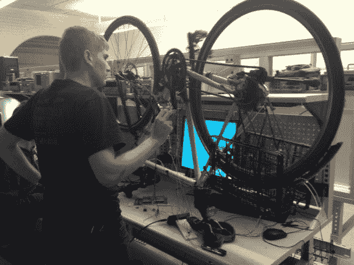

# 在一周内制造一个自动自行车变速器

> 原文：<https://hackaday.com/2013/01/18/building-an-automatic-bicycle-transmission-in-a-week/>

Carnigie Mellon 大学的 ECE 系每年都会举办 Build18，这是一个旨在让学生走出教室进入车间的工程节。[安德鲁·托特]与团队成员[詹娜·麦克卡利]、[彼得·麦克黑尔]和[尼古拉斯·梅利斯]上周一直忙于组装自动自行车变速器。

大多数骑自行车的人都认为 80 转/分的节奏对大多数骑自行车的人来说刚刚好。该团队的变速器使用霍尔效应传感器来感应骑车人的节奏，如果节奏低于 60 转/分钟，就会换到更高的档位，如果节奏高于 100 转/分钟，就会换到更低的档位。

建筑节的要求之一是完工项目的成本必须低于 250 美元。通过使用 Arduino Mega 和伺服系统来换档，该团队拥有一个相当低成本的自动更换自行车齿轮的解决方案。

这是一个非常酷的项目，希望我们能在美国东部时间今天中午比赛结束后看到视频。