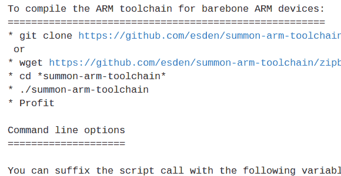

# Mac 上 ARM 交叉编译工具链的指南和帮助脚本

> 原文：<https://hackaday.com/2013/01/18/a-guide-and-helper-script-for-arm-cross-compiling-toolchain-on-a-mac/>

[Mitchell Johnson]想在他的 Mac 上开发 STM32F4 发现板。对于 ARM 工具链，有几个现成的选项，但他找不到一个能满足他所有需求的。在解决了所有的问题后，他写了一份指南，并修改了一个脚本，以便在 Mac 电脑上安装 ARM 工具。

他遇到的一些预打包工具链的问题是，它们不支持 STM 的 Cortex-M4 芯片的硬件浮点功能。为了绕过这个问题而不做他自己的基础构建(这可能是一个相当大的挑战)[他分叉了召唤臂工具链脚本](https://github.com/ehntoo/summon-arm-toolchain)并对其进行了修改，以在构建中包括 ST-Link 支持。我们喜欢这个脚本的一点是，它将工具安装在您主目录的子目录中。这样，如果您已经有另一个手臂工具链，您可以通过调整路径变量在两者之间切换。