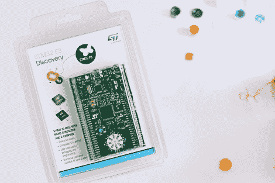

# STM32 F3 开发板的更好模板

> 原文：<https://hackaday.com/2013/01/20/a-better-template-for-your-stm32-f3-dev-board/>

如果你已经挑选了一个非常酷的 STM32 ARM 开发板，你可能正在四处寻找一个好的工具链。不要害怕，因为马特会支持你。他[为 ARM Cortex-M4 驱动的 STM32 板组装了一个模板](https://github.com/mblythe86/stm32f3-discovery-basic-template)。

[Matt]一直在使用我们在之前讨论过的 STM 32 F4[的模板，但是发现实现有点欠缺。为了利用他的 STM32 F3 板的功能，[Matt]采用了我们自己的[Mike S]](http://hackaday.com/2012/09/27/stm32-f4-discovery-tutorial-using-open-source-tools/) 开发的 F0 模板[，并将其用于更新、更好的开发板。](http://hackaday.com/2012/06/17/template-for-building-stm32f0-discovery-project-in-gcc/)

使用[Matt]的模板有一些好处；F3 发现板中的 ARM 芯片有一个硬件浮点单元，使用 Code Sourcery G++: Lite Edition 工具链无法访问该单元。[Matt]使用 gcc-arm-embedded 允许访问硬件 FPU，这对于一款优秀的主板来说是一大优势。