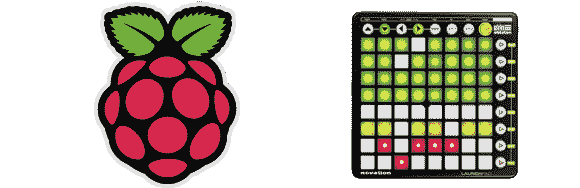

# 玩腻了 MacBook？演奏树莓派！

> 原文：<https://hackaday.com/2013/01/21/tired-of-playing-the-macbook-play-the-raspberry-pi/>

去任何有音乐家在场的俱乐部、派对或聚会，你可能会发现一个堆满了推子、各种 MIDI 设备和 MacBook 的 DJ 摊位。无论 OS X 的 DJ 平台有多丰富，我们都没有听说过树莓 Pi 被用作音序器、MIDI 设备或 MaxMSP 盒。

[James]在 lighted Sound[做了一个很棒的教程](http://www.illuminatedsounds.com/?p=2057)，让所有那些很酷的电子音乐设备都可以用树莓皮播放。他使用了一个 [Novation Launchpad](http://us.novationmusic.com/launchpad) ，一个 8×8 的 MIDI 控制器，可以充当推子、键盘，甚至是 MPC 上的 pad 的功能等价物。

没有软件硬件什么都不是，所以[James]用 [Puredata](http://en.wikipedia.org/wiki/Pure_Data) 和 libusb 把 MIDI 数据变成音符和音效。

[James]添加了一个下载，其中包括 Launchpad 驱动程序和一个 Puredata 草图来测试一切。休息过后，你可以在视频中看到这一切是如何结合在一起的。

[https://player.vimeo.com/video/57803782](https://player.vimeo.com/video/57803782)