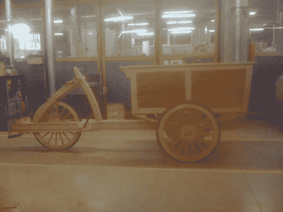

# 木制货运自行车

> 原文：<https://hackaday.com/2013/01/24/wooden-cargo-bicycle/>

这是一辆几乎完全由木头制成的货运自行车。[Niels]和他的三个同学在 Wico Campus Tio 建造了它，这是一所位于比利时 Dorpsstraat 的科技学校。这个建筑有很多令人印象深刻的地方。当然，这些人承认不是所有的东西都是木头。他们使用金属螺丝以及轮毂、曲轴和自行车齿轮(在这张图片中看不到)。但是其他所有的东西都是由山毛榉木或红木制成的。这包括板簧，有助于缓冲货物箱在路上颠簸。

盒子本身就充当了把手。你可以看到支架，它支撑着横跨盒子左侧的销钉的一端。这张图片是在添加座椅和曲柄之前拍摄的，但一旦它们到位，前轴将随着转向盒一起转动。

休息之后你可以好好看看视频里的成品自行车。您还可以在那里找到 Power Point 幻灯片的链接。由于该演示文稿是荷兰语，我们翻译了文本并粘贴在下面。

[https://www.youtube.com/embed/2uhDXFoQzfE?version=3&rel=1&showsearch=0&showinfo=1&iv_load_policy=1&fs=1&hl=en-US&autohide=2&wmode=transparent](https://www.youtube.com/embed/2uhDXFoQzfE?version=3&rel=1&showsearch=0&showinfo=1&iv_load_policy=1&fs=1&hl=en-US&autohide=2&wmode=transparent)

下载 power point 演示文稿: [15 张荷兰语幻灯片](http://hosted.hackaday.com/De%20Bakfiets.pptx)

### 谷歌翻译的 Power Point:

"贝克朋"

2012-2013 年木材奖

这个想法

*   这个想法来自于自行车，另一个想法来自于旧的轻便摩托车或小型摩托车。这会花费太多的时间，然后我们组的一个人说:‘为什么我们不造自行车？’？首先，它会是一个横卧的，但这有点太简单了，所以我们去挑战一辆三轮车，几乎完全是木头做的。

这个想法

配件

*   车轮:这些我们完全从木材，只有木制的轮辋，我们工作的一个自行车车轮原来的金属轮毂。

*   曲轴:曲轴是在车架上铣出来的，然后我们在木头上加工一个从旧自行车上切下来的曲轴。

配件

*   盒子:这是一个简单的风格和线条结构，面板在面板凹槽中。面板的凹槽深度为 10 毫米。为了更好地观看，这些面板随后被粘上假的样式。

*   弹簧:弹簧是我们自己用每片 7 毫米厚的山毛榉板条做成的，50 毫米厚的弹簧片就形成了。板簧有 80 毫米宽。

伍兹

*   清蒸山毛榉

*   帕杜克

设计

要求的尺寸

*   座管长度:0.68 厘米
*   座管角度:66-70 度
*   内径自行车轮圈

边缘词由 4 个不同的部分组成。这些是连接在一起的，在每一段的周围都有一个凹槽，在这个凹槽里，一个真正的自行车轮圈的外圈是完美尺寸的保险箱。

辐条

*   首先，我们制作 21x21mm 毫米的木板条
*   它变成 7 毫米宽、3 毫米深的铣槽
*   然后在 paddouk 有小板条粘在细节上
*   胶水干了以后，周围的辐条就用砂纸打磨了

中心

*   将有一个自行车轮毂粘在一块
*   这一块然后在我们的枢纽枢纽胶合
*   车轮的其余部分将围绕这个轮毂制造。

trax

*   多米诺木钉作为连接，
*   在一边的角落里，我们有样式，但 40 毫米宽，所以它是由立柱的厚度制成的，它们仍然延续到 60 毫米，
*   摇杆被拧到容器上，

板簧

底盘

座管结构

*   用带锯从横梁上锯下。
*   用螺母和螺栓将 rampa 固定。
*   3 个部分带有一个笔 paddouck。
*   座杆是用胶水和螺丝固定的。