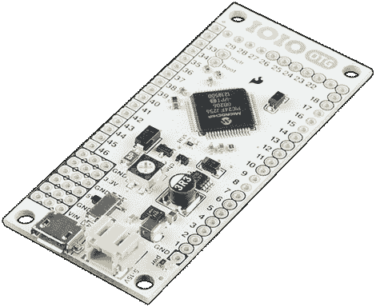

# 新的 IOIO 更快、更便宜

> 原文：<https://hackaday.com/2013/01/25/new-ioio-is-faster-cheaper/>

在过去的几年里，[Ytai]一直致力于 IOIO，一种将你的 Android 设备与其他自制外设连接起来的设备。现在推出了这款非常酷的主板的新版本[,它包括一些急需的功能，如 USB OTG，以及更低的组件成本，这将节省您的成本。](http://ytai-mer.blogspot.com/2013/01/go-go-ioio-on-go.html)

几个月前，我们自己的[Mike Szczys] [瞥见了这个新的 IOIO 板](http://hackaday.com/2012/09/15/video-preview-new-ioio-prototype/)。它的大小与之前的版本相同，但通过 USB-OTG，新的 IOIO 在连接到手机时可以是主设备，在连接到 PC 时可以是从设备。

除了 USB-OTG，[Ytai]还改进了电源调节电路，甚至拒绝向电路板支付版税以降低成本。目前在 Sparkfun 可以买到，售价 40 美元。

[Ytai]表示，他正在对 IOIO 进行一些软件升级，包括使电容传感成为可能，并包括对步进电机和控制器的支持。还有对即将到来的树莓派的支持，但我们只是很高兴[Ytai]设法在底部丝网印刷上放置了一个溜溜球图形。最后，希望每个人都知道 IOIO 的发音。