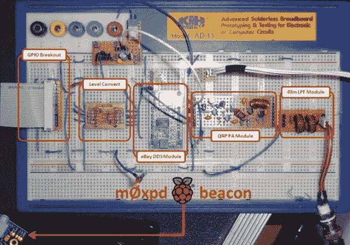

# Raspberry Pi 用作信标发射机

> 原文：<https://hackaday.com/2013/01/25/raspberry-pi-used-as-a-beacon-transmitter/>

[m0xpd]从易贝获得了一款廉价的 AD9850 DDS 模块，但需要一种方法来控制它。他从使用 PIC 微控制器的项目中获得灵感，但决定加入自己的想法，使用树莓 Pi 构建多模式信标发射器。

绿色的 AD9850 模块位于该试验电路板电路的中心。它的左边是一个电平转换器，他从 RPi 板获得 3.3V 电平，以便与其余的 5V 硬件一起工作。该信号然后馈入 QRP 放大器和低通滤波器。

在编写 RPi 代码时，他并没有从头开始。相反，他为相同的 DDS 抓取了一个 Arduino 草图，并将其移植到 Python 上。第一个测试信号是他用莫尔斯电码以 QRSS 速度发出的呼号。但是他也设法让 [Hellschreiber](http://hackaday.com/2012/01/12/hellduino-hellschreiber-radio-transmissions-from-an-arduino-board/) 消息工作，使它成为一个多模式设备。

[via [焊料烟雾](http://soldersmoke.blogspot.com/2013/01/the-raspberry-e-bay-multi-mode-beacon.html)