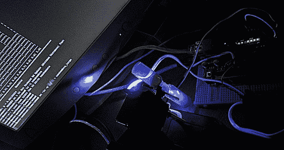

# 改进的沙漏熵

> 原文：<https://hackaday.com/2013/01/25/improved-hourglass-entropy/>

[Wardy] [用他到处都有的零件为自己建造了一个高质量的熵源](http://wardyprojects.blogspot.com/2013/01/true-rng.html)。这是基于本月早些时候我们在链接帖子中看到的[的沙漏熵项目。就像那个项目一样，他从下落的沙子上反弹激光并读取结果。但是他给党带来了一些创新，并且有测试结果来支持他的工作。](http://hackaday.com/2013/01/17/hackaday-links-january-17th-2013/)

第一个变化很明显；将沙漏电动化，这样就不需要用手翻转了。我们认为这可能会扰乱激光校准，但休息后的剪辑证明我们错了。他改进了传感器，使用一个连接到 NPN 晶体管基极的 LED。下一个变化是将光传感器与激光器成一个角度安装，而不是直着安装。这种方法拾取的是激光的反射光，而不是直射光束本身，因此读数范围更广。

他使用以太网屏蔽将系统接入网络。它每秒推送 420，000 个随机数，并且用[的死忠套装](http://www.phy.duke.edu/~rgb/General/dieharder.php)进行了测试。它没有得到很高的分数，但它确实通过了测试。

<object type="application/x-shockwave-flash" width="500" height="375" data="https://www.flickr.com/apps/video/stewart.swf?v=1535363810" classid="clsid:D27CDB6E-AE6D-11cf-96B8-444553540000"><param name="flashvars" value="intl_lang=en-us&amp;photo_secret=518a707015&amp;photo_id=8402731589&amp;flickr_show_info_box=true"><param name="movie" value="https://www.flickr.com/apps/video/stewart.swf?v=1535363810"><param name="bgcolor" value="#000000"><param name="allowFullScreen" value="true"><embed type="application/x-shockwave-flash" src="https://www.flickr.com/apps/video/stewart.swf?v=1535363810" bgcolor="#000000" allowfullscreen="true" flashvars="intl_lang=en-us&amp;photo_secret=518a707015&amp;photo_id=8402731589&amp;flickr_show_info_box=true" height="375" width="500"></object>

[via [危险原型](http://dangerousprototypes.com/2013/01/24/high-quality-entropy-source/)