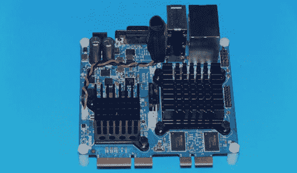

# Gizmo 板，一个微型 X86 开发板

> 原文：<https://hackaday.com/2013/01/26/gizmo-board-a-tiny-x86-dev-board/>

随着 Raspberry Pi 和其他 ARM 开发板看到自己的时代即将到来，其他芯片制造商想要参与进来也就不足为奇了。AMD 发布了一款名为 Gizmo 的非常小的 x86 开发板，这是一款四英寸见方的板，可以将台式电脑缩小到你的手掌大小。

这个小玩意由双核 x86 Brazos CPU 驱动，运行速度为 1 GHz，内置镭龙 HD 6250 图形引擎。板上还有 1GB DDR 3 RAM、SATA、以太网、USB、VGA、音频、PCI 和 PCIe 端口，以及大量 GPIO 引脚，包括 ADC 和 DAC。所有这些都在一个四英寸见方的封装中，其性能是树莓派的两倍。

虽然这个小发明的价格——200 美元一个[浏览器套件](http://www.gizmosphere.org/buy/)——可能会阻止它像 Raspberry Pi 或其他 ARM 板一样受欢迎，但有时你只需要一个 x86 平台来完成这项工作。凭借 Gizmo 强大的图形潜力，我们可以很容易地看到这种板被用于一些计算机视觉或自主机器人构建中。