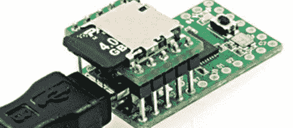

# 使用 USB HID 提取数据

> 原文：<https://hackaday.com/2013/01/26/extracting-data-with-usb-hid/>

高安全性工作站有一些非常奇特的保护数据的方法。其中之一是禁用任何可能进入系统 USB 端口的 USB 闪存驱动器。安全是一场猫捉老鼠的游戏，所以当然有办法绕过这些措施。[d3ad0ne]想出了一种通过使用 USB HID 协议将文件转储到 SD 卡上的方法。

在之前，我们已经见过[这种微控制器携带可执行程序来提取数据的情况。以前，最好的方法是闪烁键盘上的大写锁定 LED，一次向微控制器发送一位。[d3ad0ne]的构建利用了 USB HID 协议，但不是每秒 1 位，而是每秒约 10kBps。](http://hackaday.com/2012/10/30/extracting-data-with-keyboard-emulation/)

为了从系统中提取数据，[ d3ad0ne]将一个 Teensy 微控制器连接到 USB 端口。打开记事本后，[ d3ad0ne]按下 Caps Lock 键，强迫青少年打出一个可执行的脚本。这个可执行文件是一个基本的应用程序，可以通过 USB 电缆将任何文件发送回存储在 SD 卡上的 Teensy。除了用环氧树脂填充工作站的 USB 端口，真的没有办法防止安全文件从电脑中泄露出去。