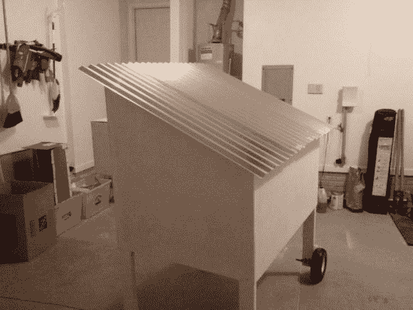

# 移动鸡舍包括无线传感器

> 原文：<https://hackaday.com/2013/01/28/mobile-chicken-coop-includes-wireless-sensors/>

就其本身而言，这个移动鸡舍是一个相当不错的建筑。有一些额外的功能潜伏在里面，你不会发现大多数合作社。【neuro mancer 2701】[内置一组可以无线接入的传感器](http://www.instructables.com/id/Mobile-Chicken-Coop-with-some-automation)。不用离开沙发就能检查母鸡的舒适度。

传感器系统的核心是一个 Arduino 和一个 Xbee 模块。构建还没有完全完成，但是到目前为止已经实现了三个传感器。热敏电阻用于读取鸡舍内的温度。为了确保有足够的水，水库上贴了两张箔带。CapSense 库测量这些极板之间与水位相关的电容([我们在](http://hackaday.com/2009/12/08/overly-complicated-gas-guage/)之前已经见过这种类型的水位传感器)。最后，还有一个传感器可以告诉你鸡舍的门是开着还是关着。

他在自动开门方面有困难。这可能相当棘手，尤其是如果你使用一个超级复杂的锁定机制[，就像这个](http://hackaday.com/2010/05/03/automated-chicken-coop-door/)。