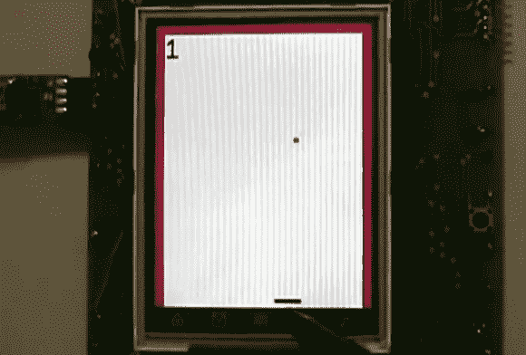

# 便携式游戏机使用 SSD1289 和 Propeller

> 原文：<https://hackaday.com/2013/01/28/portable-gaming-console-uses-ssd1289-and-propeller/>

[Samir]涉足业余电子爱好，并决定通过[制作这个便携式游戏控制台](https://sites.google.com/site/samiraraujo/projects/portable-video-game-console) ( **注:**该网站使用的 HTTPS 地址不能通过 Google Tranlator 使用。对 Chrome 浏览器翻译器确实有效)。上图是他的突围风格游戏的截图。底部的拨片由触摸屏控制。你来回移动它，以防止球越过底部边缘(它从侧面和顶部的红色边界反弹)。

主 PCB 比 3.2 英寸的 LCD 尺寸大，但[Samir]确保包括许多外围设备来弥补这一点。这款游戏板配备了一个视差推进器芯片来运行游戏。它与 SSD1289 屏幕接口(这是[一个便宜和受欢迎的选择](http://hackaday.com/2012/07/05/library-for-driving-ssd1289-lcd-displays-with-small-microcontrollers/))，但这真的会吃掉很多 IO 引脚。我们已经提到过，可以使用触摸屏来控制游戏。但是还有另外两个选择。有一个扩展端口使用移位寄存器(74HC165)来串行化输入。为了制作原型，这允许[Samir]使用 Atari 操纵杆。他还在项目中加入了一个蓝牙适配器，我们很乐意看到它与 Wii 遥控器一起工作。外围设备还包括一个 SD 卡插槽、声音音频插孔和一个用于计时的 RTC 芯片。

上面链接的帖子里有几个视频。休息之后，我们嵌入了截图中的游戏演示。

[https://www.youtube.com/embed/hG56_Ak0fDo?version=3&rel=1&showsearch=0&showinfo=1&iv_load_policy=1&fs=1&hl=en-US&autohide=2&wmode=transparent](https://www.youtube.com/embed/hG56_Ak0fDo?version=3&rel=1&showsearch=0&showinfo=1&iv_load_policy=1&fs=1&hl=en-US&autohide=2&wmode=transparent)