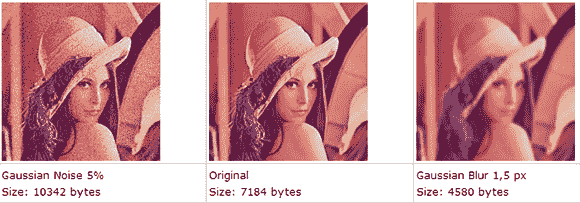

# 再次破解 MintEye 验证码

> 原文：<https://hackaday.com/2013/01/29/breaking-the-minteye-captcha-one-more-time/>

不久前，我们看到 MintEye CAPTCHA 系统——一个“你是人类吗”的测试，要求你移动滑块，直到图像消除漩涡和模糊——通过利用辅助功能选项而完全打开。后来，在一次巧妙的图像处理中，MintEye 验证码再次被破解，它提出了一种算法来检测图像是否被去漩涡和去模糊。

看来我们还没有完成[mintee 验证码](http://habrahabr.ru/post/167359/)(俄语，[翻译](http://translate.google.com/translate?sl=ru&tl=en&js=n&prev=_t&hl=en&ie=UTF-8&eotf=1&u=http%3A%2F%2Fhabrahabr.ru%2Fpost%2F167359%2F&act=url))。现在，MintEye CAPTCHA 可以在没有任何图像处理或文本到语音库的情况下被破解。用 31 行 Java 代码，你也可以打开 MintEye。

黑客背后的想法来自这样一个事实，即模糊的图像将比非模糊的图像小得多。这有道理；图像的细节越少，文件就越小。嗯，MintEye 传送到你电脑上的所有图片——30 张，每个漩涡和模糊步骤一张——都是相同的大小，这意味着“错误答案”的图片在文件末尾用零填充。

在构建页面上有一个 31 行的程序，展示了如何查看 30 个 MintEye 图像，并找到文件末尾零最少的图像。顺便说一下，这是 MintEye CAPTCHA 的正确答案，并且具有 100%的再现性。

那么，有人知道 MintEye 是不是上市公司吗？此外，你如何确切地做空一只股票？