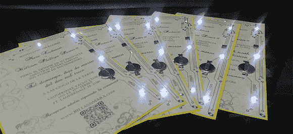

# 非常非常讨厌的婚礼请柬

> 原文：<https://hackaday.com/2013/01/30/really-really-geeky-wedding-invitations/>

作为真正的极客，[比尔]和[玛拉]不想满足于简单的纸质婚礼请柬。不，他们想要更酷的东西，想出了他们自己 DIY 的电子婚礼请柬。

因为他们要自己制作请柬，所以[比尔]和[玛拉]需要一个简单的电路，可以很容易地大规模生产。他们转向由 ATtiny13 供电的经典微控制器供电的闪烁 LED 电路。

第一项任务是为每份邀请函生产 50 块印刷电路板。为此，[比尔]从易趣上买了一台施乐 Phaser 激光打印机和几张覆铜 kapton 胶片。将抗蚀剂直接印刷在 kapton 膜上，并在氯化铁浴中蚀刻，有效地制成了柔性 PCB。

在[剪影浮雕切纸刀](http://www.silhouetteamerica.com/)的帮助下，这些电路板被焊接并层压在印刷好的邀请函和卡片材料切割器之间。卡片组装完成后，电池被连接起来，卡片被运出。

卡内的微控制器被编程为大部分时间处于睡眠状态，仅每隔几秒钟醒来检查光传感器以确定卡是否被打开。如果微控制器感应到卡片是打开的，灯就开始闪烁，这将成为[比尔]和[玛拉]的客人们收到的最难忘的婚礼请柬之一。

休息之后你可以看看邀请函的演示。

[https://www.youtube.com/embed/1ma1f3YOkl8?version=3&rel=1&showsearch=0&showinfo=1&iv_load_policy=1&fs=1&hl=en-US&autohide=2&wmode=transparent](https://www.youtube.com/embed/1ma1f3YOkl8?version=3&rel=1&showsearch=0&showinfo=1&iv_load_policy=1&fs=1&hl=en-US&autohide=2&wmode=transparent)