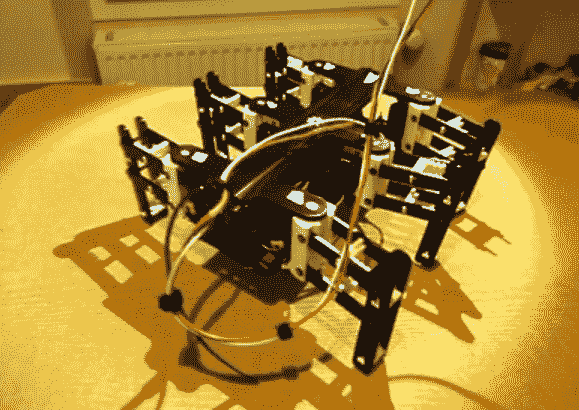

# 3d 打印六足机器人

> 原文：<https://hackaday.com/2013/01/30/3d-printed-hexapod-robot/>

这个[六足机器人几乎完全是通过 3d 打印制作的](http://www.digitalspirit.org/blog/index.php/post/2012/08/06/Le-retour-de-l-hexapode-Bleuette) ( [翻译](http://translate.google.com/translate?hl=en&sl=auto&tl=en&u=http%3A%2F%2Fwww.digitalspirit.org%2Fblog%2Findex.php%2Fpost%2F2012%2F08%2F06%2FLe-retour-de-l-hexapode-Bleuette))。您需要提供的零件包括几个用于连接的紧固件、十二个伺服电机和一种驱动它们的方法。正如你在休息后的视频中看到的，所有这些部分组合成一个功能相当好的小机器人。我们认为唯一缺少的是一些防滑的脚。

[Hugo]称这个项目为 Bleuette。它是完全开源的，cad 文件和源代码可以在[他的 Github 库](https://github.com/hugokernel/Bleuette)上获得。该回购的 wiki 页面中有更多信息。这让我们[很好地了解了电子设计](https://github.com/hugokernel/Bleuette/wiki/Electronics)。他用 Arduino 控制腿，但这一切都依赖于他自己的屏蔽，该屏蔽具有 PIC 18F452，以处理用于驱动所有伺服电机的信号。该板还有一些外设来监控电流消耗和调节输入功率。

[https://player.vimeo.com/video/58307246](https://player.vimeo.com/video/58307246)