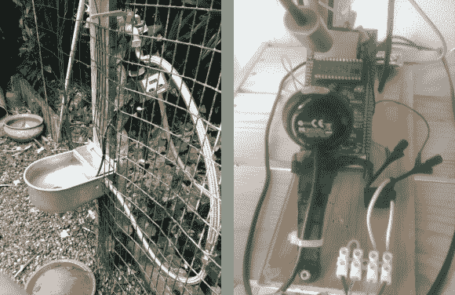

# 自动水和食物宠物分配器的反馈

> 原文：<https://hackaday.com/2013/01/30/feedback-for-automated-water-and-food-pet-dispensers/>

[恩里科]想出了一个完全自动化他的宠物食物和水的方法。该系统由两部分组成，左边是水槽，右边是食品分发器，其控制硬件显示在右边。这个系统甚至连到了网络上，这样他就可以确保在他不在的时候系统不会崩溃。

饮水机使用洒水系统的零件。由于它安装在室外，即使水溢出一点点也没关系。所以[恩里科]设置了计时器，每天让水流动三分钟。这作为一个备用系统，因为槽已经有能力重新填充自己。

食品分发器开始是一个商业单位。为了从系统中获得反馈，他在搅拌马达上添加了几块磁铁，并用霍尔效应传感器读取它们。除了监控喂食器周围区域的 IP 摄像头(因此[Enrico]可以实际看到他的狗在吃东西)之外，还有一个监控 STM32 发现板的网络摄像头，该发现板监控喂食器。它跟踪分配器运行的次数。