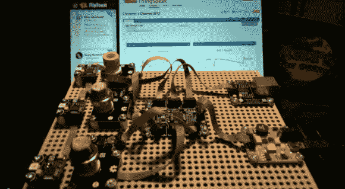

# 配有 Gadgeteer 模块的气体传感器套件

> 原文：<https://hackaday.com/2013/01/31/gas-sensor-suite-built-with-gadgeteer-modules/>

[Blake]刚刚完成[一套由 Gadgeteer 零件制成的气体传感器套件](http://www.youtube.com/watch?v=ro2Wd1ciEpY)。三个传感器是沿组件左侧的圆柱形塔。顶部的那个(有橙色圈的)是酒精传感器。中间的传感器感应氨，下面的传感器测量空气质量。温度和湿度传感器也融入其中。

使用这种类型的设置，您可以收集大量数据。为了保持条理，布莱克使用了 ThingSpeak 界面。他使用右上角的网卡[上传测量结果，用于实时绘图](https://thingspeak.com/channels/3512)。在休息后的视频中详细解释了设置，包括一些清洁氨的测试。

我们还没有亲自尝试过 Gadgeteer 系统。但你不得不承认，该系列零件使用的带状电缆连接器系统确实有助于保持像这样一个相当复杂的设置整洁。

[https://www.youtube.com/embed/ro2Wd1ciEpY?version=3&rel=1&showsearch=0&showinfo=1&iv_load_policy=1&fs=1&hl=en-US&autohide=2&wmode=transparent](https://www.youtube.com/embed/ro2Wd1ciEpY?version=3&rel=1&showsearch=0&showinfo=1&iv_load_policy=1&fs=1&hl=en-US&autohide=2&wmode=transparent)