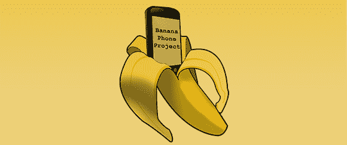

# 用香蕉手机摆脱电话推销员

> 原文：<https://hackaday.com/2013/02/01/getting-rid-of-telemarketers-with-a-banana-phone/>

美国联邦贸易委员会真的不喜欢 robocalls 和其他电话推销员向你推销乙烯基墙板或家庭安全升级。联邦贸易委员会甚至向任何能除掉这些机器人电话推销员的人提供 50，000 美元,[亚历克斯]看起来他可能会领奖。他开发了香蕉电话，这种设备消除了那些讨厌的电话推销员。

香蕉电话的基本思想是要求呼叫者在连接到主线之前输入一个四位数的密码(通过文本到语音播放一首相关的歌曲来防止机器人接通)。一旦来电者被确认为人类，他们的号码就会被添加到白名单中，这样他们就不用每次打电话都要听 Raffi 了。

香蕉手机使用现成的部件，包括树莓 Pi 和[电话/以太网适配器](http://www.obihai.com/docs/OBi110DS.pdf)，总成本不到 100 美元。您可以在大约 2:25 开始的休息后查看香蕉手机的运行演示。

[https://www.youtube.com/embed/ovaWvFQgrqU?version=3&rel=1&showsearch=0&showinfo=1&iv_load_policy=1&fs=1&hl=en-US&autohide=2&wmode=transparent](https://www.youtube.com/embed/ovaWvFQgrqU?version=3&rel=1&showsearch=0&showinfo=1&iv_load_policy=1&fs=1&hl=en-US&autohide=2&wmode=transparent)