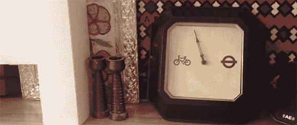

# 气压计告诉你骑自行车或者坐火车

> 原文：<https://hackaday.com/2013/02/01/barometer-tells-you-to-take-your-bike-or-the-train/>

在开始一天的工作之前，[Richard]需要决定是骑自行车去上班还是乘伦敦地铁。做出这个决定的所有信息都可以在网上找到——当前的天气预报，以及他将要乘坐的地铁线路和车站的状况。然而，问题是所有这些信息分散在多个地方。[Richard]对此的解决方案是[制作一个自行车晴雨表](http://blog.oftcc.net/post/39219681688/the-bicycle-barometer-takes-data-about-the)，从这些地方获取数据，并为他做出骑自行车还是坐地铁的决定。

[理查德]的气压计是围绕他在跳蚤市场找到的一个纳米电极和一个旧时钟制作的。纳米节点查询英国气象局和伦敦地铁的线路和车站状态。所有考虑的变量都是加权的；如果下雪，产量更有可能取决于地铁，而不是毛毛雨。

这是一个非常酷的建筑，它充分利用了伦敦地铁提供的公共 API。休息之后你可以看看气压计的视频。

[https://www.youtube.com/embed/GP6LIhDopQk?version=3&rel=1&showsearch=0&showinfo=1&iv_load_policy=1&fs=1&hl=en-US&autohide=2&wmode=transparent](https://www.youtube.com/embed/GP6LIhDopQk?version=3&rel=1&showsearch=0&showinfo=1&iv_load_policy=1&fs=1&hl=en-US&autohide=2&wmode=transparent)