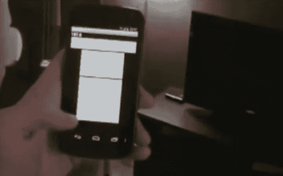

# 通用地理空间灯开关

> 原文：<https://hackaday.com/2013/02/03/the-universal-geospatial-light-switch/>

家庭自动化已经以这样或那样的形式存在了一段时间，但我们认为这种控制灯光的方式非常有趣。这个 Android 应用程序让你将手机对准设备，然后打开或关闭它，而不是有一个可以打开或关闭的灯菜单。无疑类似于[达斯·维德]在家里控制灯光的方式。

虽然这个项目的真正技术细节没有列出，但这个设置读取 Android 设备的指南针和 GPS 输出，以确定它在空间中的指向。结合理解房间布局的脚本和[X10]自动化控制器，它能够精确地控制灯光。

一定要看看这个设备的运行视频，或者看看[【Mike】【Project Rita】](http://nebbiatech.tumblr.com/ "Project Rita")的博客，看看他正在进行的其他有趣的项目！

[https://www.youtube.com/embed/2W8ueJKrmfI?version=3&rel=1&showsearch=0&showinfo=1&iv_load_policy=1&fs=1&hl=en-US&autohide=2&wmode=transparent](https://www.youtube.com/embed/2W8ueJKrmfI?version=3&rel=1&showsearch=0&showinfo=1&iv_load_policy=1&fs=1&hl=en-US&autohide=2&wmode=transparent)