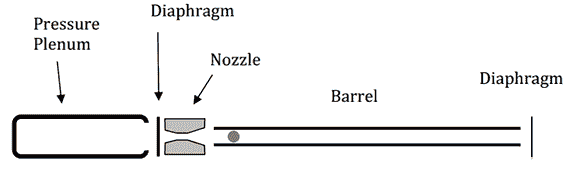

# 以 1.2 马赫的速度射击乒乓球

> 原文：<https://hackaday.com/2013/02/04/shooting-ping-pong-balls-at-mach-1-2/>

下次你在一场 Nerf 枪战中，你最好希望你有[这种荒谬的强大乒乓球枪](http://www.technologyreview.com/view/510286/how-to-build-a-supersonic-ping-pong-gun/)。它以超过每秒 400 米或 1.2 马赫的速度拍摄普通的赛璐珞球体。

这支乒乓球枪是普渡大学的马克·弗伦奇、克雷格·泽赫伦和吉姆·斯特拉顿的作品。如你所料，喷枪由压缩空气驱动，压缩空气装在一根 3 英寸长的 80 号 PVC 管中。压力容器的一端用 PVC 端盖密封，而另一端用一条对折的管道胶带封闭，以控制压力。

有趣的是在压力容器和枪管之间有一个拉伐尔喷嘴。就像火箭发动机喷嘴一样，这种加工过的聚氯乙烯压缩通过破裂的胶带密封的空气，并允许它再次膨胀，以超音速推进枪口装载的乒乓球。

这些人写了一份关于他们枪支的报告，你可以在 arxiv 上找到。