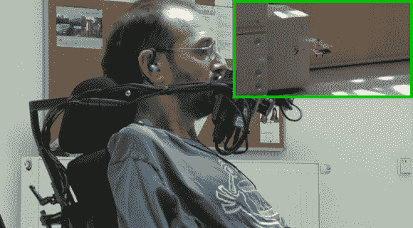

# 用于驾驶红外直升机的自适应技术

> 原文：<https://hackaday.com/2013/02/04/adaptive-technology-used-to-fly-an-ir-helicopter/>

这位先生正在用他颈部肌肉的电脉冲驾驶一架玩具直升机在房间里飞来飞去。该项目是 the AsTeRICS 项目 T3 的一个示范，该项目旨在降低调整残疾人技能组合的复杂性，使其能够完成多种功能。在这种情况下，控制直升机可以很容易地切换到其他任务，而不需要改变用户界面硬件。

AsTeRICS 项目的一个插件使用了 OpenEEG 库。它读取来自每个肩膀顶部的一对电极的信号。在休息后的视频中，你可以看到当他弯曲这些肌肉时，信号的变化被映射到直升机的高度。这只是广泛输入的一个例子，包括建立基于网络摄像头的鼠标或使用面部识别。

玩具本身是由 Arduino 发送红外命令驱动的。我们已经看到了相当多的项目，其中[直升机通信协议暴露无遗](http://hackaday.com/2013/01/21/communication-protocol-for-an-indoor-helicopter/)。

[https://www.youtube.com/embed/Tuob5hgLlnc?version=3&rel=1&showsearch=0&showinfo=1&iv_load_policy=1&fs=1&hl=en-US&autohide=2&wmode=transparent](https://www.youtube.com/embed/Tuob5hgLlnc?version=3&rel=1&showsearch=0&showinfo=1&iv_load_policy=1&fs=1&hl=en-US&autohide=2&wmode=transparent)

[谢谢彼得和大卫]