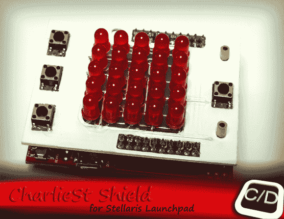

# Stellaris 发射台防护罩展示了良好的制造技术

> 原文：<https://hackaday.com/2013/02/04/stellaris-launchpad-shield-shows-good-fabrication-technique/>

这里有一个 Stellaris 发射台的 LED 和按钮护罩 ( [翻译](http://translate.google.com/translate?sl=auto&tl=en&js=n&prev=_t&hl=en&ie=UTF-8&eotf=1&u=http%3A%2F%2Fcreativityslashdesign.blogspot.com%2F2013%2F02%2Fcharliest-shield-for-stellaris.html))，你可以在家里制作。它可以让你访问一个 5×5 的 led 矩阵，并增加了四个按钮。为了减少操作灯光所需的 I/O 引脚数量，[Cosimo]正在使用[Charlie plexing](http://en.wikipedia.org/wiki/Charlieplexing)的概念。这让他仅用六个驱动销和四个按钮销就逃脱了。

我们感兴趣的不仅仅是成品。虚构本身值得点击进入他的项目帖子。最初引起我们注意的是使用 Kapton 胶带作为绝缘体，以便在安装 led 之前，可以将剪下的 led 用作跳线，平放在电路板的顶部。在这些被焊接到位后，他把它们和按钮的脚印都遮住，并用喷漆保护电路板的顶部。最终的外观比大多数家用项目板都更加精致。