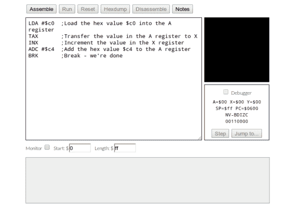

# 学习一点 6502 处理器的汇编语言

> 原文：<https://hackaday.com/2013/02/05/learn-a-little-assembly-language-for-the-6502-processor/>

Evern 想自己写 Atari 2600 游戏？这不会让你走那么远，但会教会你最基本的东西。这是 6502 处理器的组装教程。好的一面是，由于嵌入式 JavaScript 仿真器集汇编器、机器和调试器于一身，因此您只需要浏览器就可以参与其中。

6502 出现在很多早期设备中。除了前面提到的雅达利，它们还可以在 Commodore 64、Apple II 和最初的 NES 中找到。如今，你甚至可以发现人们围绕着芯片建造他们自己的计算机(对我们来说最著名的是维罗妮卡项目)。该指南开始时很慢，提供了一个工作程序，并向读者提出挑战，让他们通过编码来改变结果。它接着概述了寄存器和指令、操作符和分支，并以创建一个简单的游戏而告终。

[谢谢马蒂尔达]