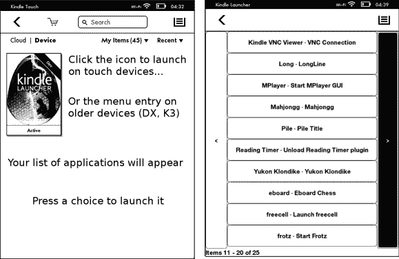

# 一个 Kindle 发射器来统治他们

> 原文：<https://hackaday.com/2013/02/05/one-kindle-launcher-to-rule-them/>

问问周围的人，你很可能会发现你的朋友或家人仍然拥有他们早期的 Kindle，但不再使用它了。你可以用它们做很多不同的事情，现在有一个单一的启动器可以为所有型号的黑客 Kindles 工作。KUAL 是 Kindle 统一应用启动器。

在你的设备上加载启动程序确实需要越狱/根目录，但这才是关键，对吗？一旦安装到您的设备上，系统很容易配置。菜单本身可以通过编辑每个列表的 XML 和 JSON 对来定制。左边的屏幕截图展示了您可能想要运行的一些应用程序。我们可以看到 VNC 浏览器是有用的，每个人都喜欢手头有游戏——像毁灭战士 II 或整个 Z-machine 库——当他们意外地被困在某个地方时。但是 MPlayer？真的有人用自己的 ePaper 设备看视频吗？