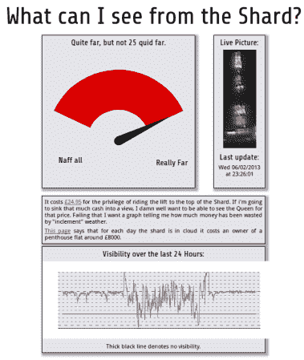

# 用 OpenCV 量化云量

> 原文：<https://hackaday.com/2013/02/07/quantifying-cloudiness-with-opencv/>

碎片大厦是西欧最高的建筑，可以俯瞰伦敦。这栋楼里的公寓非常昂贵，游客乘车到楼顶需要 24.95 英镑。

由于视图的价值如此之高，[Willem]想要量化任意给定时间的视图质量。他的解决方案是[夏德雨 Cam](http://www.secretbatcave.co.uk/electronics/shard-rain-cam/ "Shard Rain Cam") 。这个设备结合了罗技网络摄像头和树莓派来[捕捉一组延时图像](http://www.secretbatcave.co.uk/software/shard-rain-cam-timelapse-software/ "Time-lapse Software")。这些图像被输入到一个使用 OpenCV 的 Python 脚本中，该脚本[对云量进行量化](http://www.secretbatcave.co.uk/software/shard-rain-cam-quantifying-cloudy/ "Quantifying Cloudiness")。

[Willem]还必须建造一个防风雨的围栏，为摄像机和 RPi 提供一个透明的窗口。“保鲜膜”，这是英国的保鲜膜，矿物油用于改善 IP54 等级外壳的防水性能。

结果数据显示在[www.whatcaniseefromtheshard.com](http://www.whatcaniseefromtheshard.com/)上，它提供了该视图是否值 24.95 的指示。所有 Python 代码都是可用的，是学习 OpenCV 图像处理的良好起点。