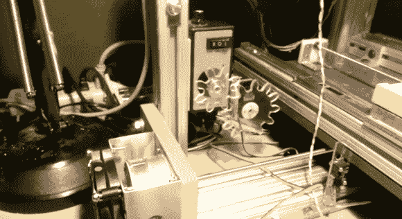

# 为 DIY 数控机床添加速度控制

> 原文：<https://hackaday.com/2013/02/12/add-speed-control-to-a-diy-cnc-machine/>

[杰西·梅里特]为他的路由器买了一个手动速度控制器。它被用在他建造的数控铣床上，他想，[为什么不给计算机增加控制速度的能力](http://www.youtube.com/watch?v=MW2ExFR2T5I)。

速度控制器是一个 20 美元的港口货运单位。它带有一个开关和旋钮，可以调节路由器的电源。[杰西]拉下旋钮，磨出一个齿轮取代它的位置。第二个齿轮连接到安装在速度控制器一侧的业余爱好伺服系统的喇叭上。休息后的视频展示了 Arduino 根据电位计输入以及来自他使用的 CNC 控制器板的命令来驱动伺服系统。

齿轮的设计文件和驱动伺服系统的 Arduino 代码可以从[他的 Github 库](https://github.com/jes1510/servospindle)获得。

[https://www.youtube.com/embed/MW2ExFR2T5I?version=3&rel=1&showsearch=0&showinfo=1&iv_load_policy=1&fs=1&hl=en-US&autohide=2&wmode=transparent](https://www.youtube.com/embed/MW2ExFR2T5I?version=3&rel=1&showsearch=0&showinfo=1&iv_load_policy=1&fs=1&hl=en-US&autohide=2&wmode=transparent)