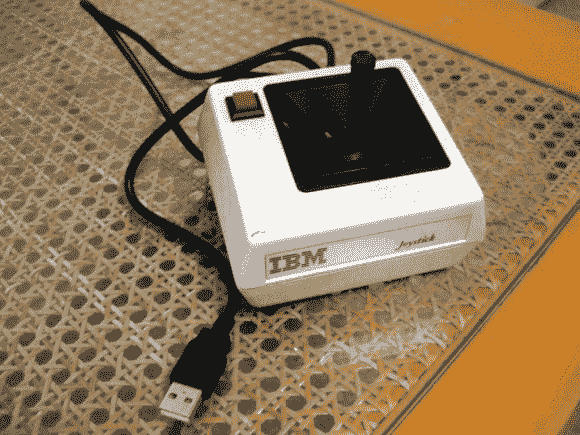

# 将 IBM PCjr 操纵杆转换为 USB

> 原文：<https://hackaday.com/2013/02/12/converting-an-ibm-pcjr-joystick-to-usb/>

再次看到这个 IBM 操纵杆真的勾起了回忆。但是由于这个 USB 转换项目，它可以用在现代系统上。

这个特殊的模型有一个我们不熟悉的连接器。它看起来像一个四四方方的 USB-A 插头，但有一个 8 针插座，看起来像是 0.1 英寸的间距。你可以尝试使用双排插头来制作你自己的插头，但是[Gruso]直接砍掉了电缆的末端。他设法挖出了设备的引脚，发现它可以连接到游戏端口——连接器是唯一真正的区别。他拆除了 USB gameport 适配器，移除了 DB15 连接器，并直接焊接到电路板上。四四方方的老外设有足够的空间来容纳印刷电路板。

如果你正在寻找更多的细节，请查看 Reddit 帖子中[Gruso 的评论。](http://www.reddit.com/r/DIY/comments/18dfxd/i_love_these_ancient_ibm_joysticks_so_i_converted/)