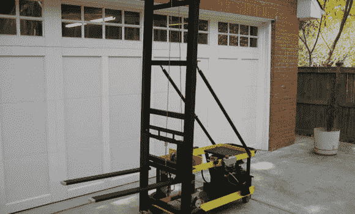

# 适合家庭商店的 DIY 叉车

> 原文：<https://hackaday.com/2013/02/13/diy-forklift-for-the-home-shop/>

[罗伯特]做了相当多的金属铸造，当然，这意味着携带数百磅的沙子，废料和其他材料。他想出了一个解决不可避免的背痛的好办法:[一个车间大小的小型叉车](http://www.homemadetools.net/forum/homemade-electric-forklift-1194#post1668)能够搬运大约半吨重的货盘。

在[这辆叉车的实际构建线程](http://www.alloyavenue.com/vb/showthread.php?3490-New-Project-Building-a-Forklift)中，【Robert】检查了设计。该升降机设计用于安装在 30 英寸×7 英寸的门框内，但能够将数百磅的重物举过操作员的头顶。它由两个电动轮椅电机驱动，由两个汽车电池提供动力。还有一个聪明的工程设计用于倾斜叉子:代替桅杆上的铰链，[罗伯特]在后轮上使用线性致动器来使叉子倾斜。

这是一个伟大的建设，因为[罗伯特]做金属铸造，有一大堆定制金属制品，真正增加了建设。休息过后，你可以看到一段视频，视频中[Robert]的铲车将一个载满 5 加仑水桶的托盘从一个很高的货架转移到另一个货架。这项工作不需要很长时间，也不需要任何提升，所以我们不得不把它交给[罗伯特]来建造。

[https://www.youtube.com/embed/jHT2UOdZRNA?version=3&rel=1&showsearch=0&showinfo=1&iv_load_policy=1&fs=1&hl=en-US&autohide=2&wmode=transparent](https://www.youtube.com/embed/jHT2UOdZRNA?version=3&rel=1&showsearch=0&showinfo=1&iv_load_policy=1&fs=1&hl=en-US&autohide=2&wmode=transparent)