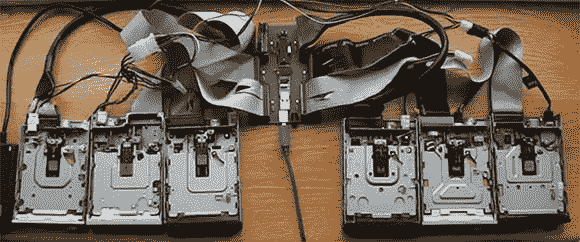

# 从头到尾构建一个六通道软驱合成器

> 原文：<https://hackaday.com/2013/02/13/building-a-six-channel-floppy-drive-synth-from-start-to-finish/>

我们已经看到许多软盘驱动器播放音乐，但从未见过像[[鲁伯特]的 Moppyduino](http://runawaybrainz.blogspot.co.uk/2013/02/arduino-moppyduino-musical-floppy.html)这样干净的项目。这是一个基于 Arduino 的板，它控制六个独立的软盘驱动器中的步进电机，哄它们播放 MIDI 文件中的音乐。

Moppyduino 不仅仅是一种控制六个软驱中步进电机的便捷方式。这也是一个很好的例子，说明家用 PCB 制造可以做些什么；整个项目是在[鲁伯特]的车间里设计和建造的。

设计完电路后，[鲁珀特]用激光打印机将它打印在塑料透明纸上。这是转移到一个覆铜板，蚀刻和钻孔。组装后，[Rupert]附上了 USB FTDI 控制器，用 Java app 接收 MIDI 数据转换的数据。

最终结果——装在定制的 Corian 外壳中——是我们见过的最好看的软盘驱动器合成器之一。休息之后，你可以看看这个令人敬畏的工具的制作过程。

[https://www.youtube.com/embed/IYQWLlBz8hE?version=3&rel=1&showsearch=0&showinfo=1&iv_load_policy=1&fs=1&hl=en-US&autohide=2&wmode=transparent](https://www.youtube.com/embed/IYQWLlBz8hE?version=3&rel=1&showsearch=0&showinfo=1&iv_load_policy=1&fs=1&hl=en-US&autohide=2&wmode=transparent)