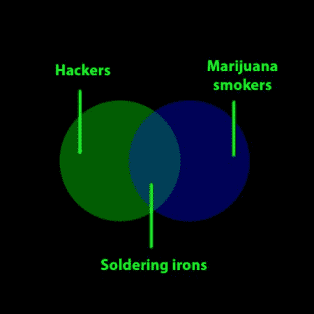

# 如何制作吸食医用大麻的汽化器

> 原文：<https://hackaday.com/2013/02/13/how-to-make-a-vaporizor-for-smoking-medical-marijuana/>

这里有一个[自制的汽化器](http://potimusprime.com/stoner-macgyver/stoner-macgyver-makes-own-magic-flight-launch-box)我们真的可以落后了。

让我们花点时间完全坦诚。暗示这可能是为了吸烟是没有意义的。医用大麻在几个州是合法的(嗯，不是联邦政府的)，我们确信那里有黑客会真正喜欢自己制作东西，而不仅仅是买些东西。

下面我们已经[报道了](http://hackaday.com/2013/01/24/hot-air-rework-doubles-as-an-herbal-bag-vaporizer/)和[一些](http://hackaday.com/2010/11/11/diy-vaporizer/)，它们似乎总是有一些共同点。他们用烙铁加热。不可避免地有人会指出这是一个多么糟糕的主意。

他们这样做是对的。烙铁上可能存在许多不好的东西，或者你用来固定东西的粘合剂，你可能不应该呼吸。那个烙铁是吸引我们开始这个项目的原因！是黑客！为我们感到羞耻(也许我们接下来会处理额定压力 PVC)。这就像用铅管喝啤酒一样。

那么，为什么有人想用蒸发器呢？稍微健康一点。你不是燃烧所有的植物材料并吸入它，你是将它加热到里面的 thc 和神奇的粘性物质沸腾并产生蒸汽，你可以呼吸。我们不知道它到底有多健康，但它至少比燃烧和吸入要好一点。

一种非常受欢迎的设备是神奇飞行发射箱或 MFLB，一种零售价约为 100 美元的便携式汽化器。人们发现事情很简单。通过使电池短路，金属丝网被加热到大约 360 华氏度(180 摄氏度)或更高。就是这样。你可能会想，我不能用电子烟吗？嗯，可能不会，它们不够热。不过，这将是一个很酷的黑客。

当建造这样的东西时，你需要做一些研究，并绝对确保你使用的材料不会杀死你。一些金属丝网涂有锌或其他化学物质。焊料显然也需要考虑。你不会真的要用处理过的木材做这个吧？你嗑药了吗？

许多人都做过 MFLB 的 DIY 版本。有些是[超级快速和无用的](http://imgur.com/a/pgHGX)，有些是[更详细的建造](http://www.reddit.com/r/trees/comments/cacyx/8_and_just_perfected_my_own_diy_magic_flight/)，有些是[甚至是焊接](http://24.media.tumblr.com/tumblr_m195lxIVVk1qlzt9eo1_1280.jpg)